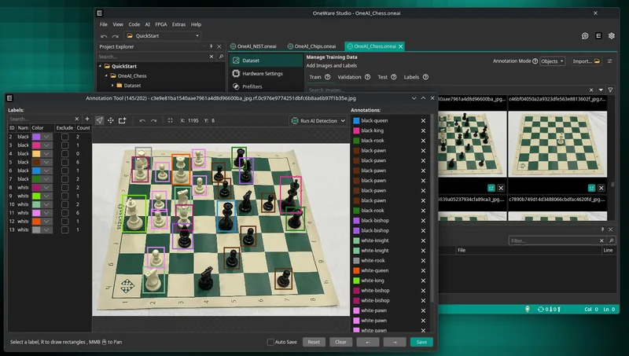
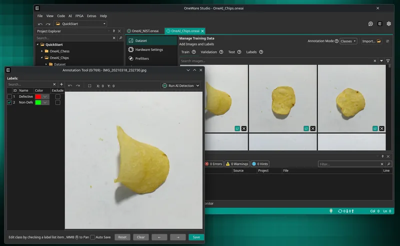
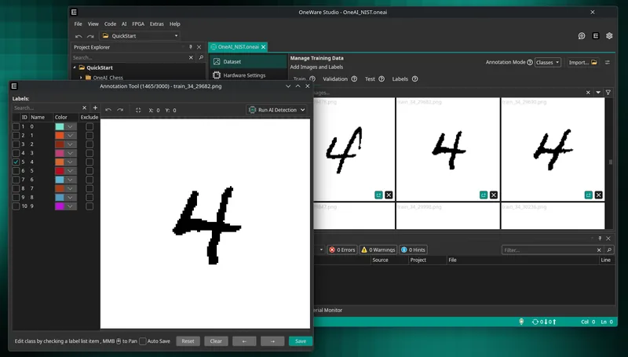
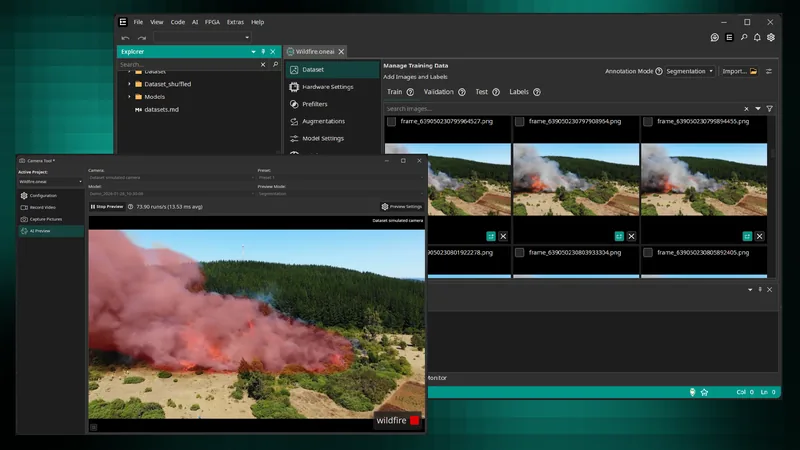
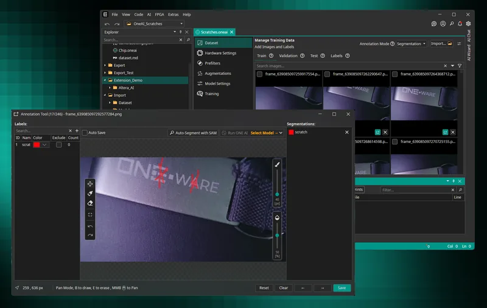
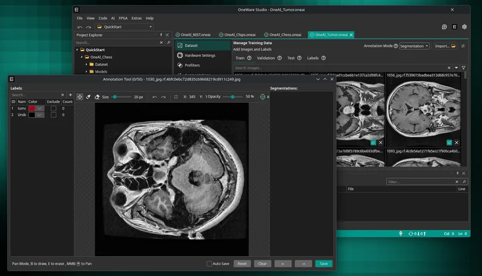
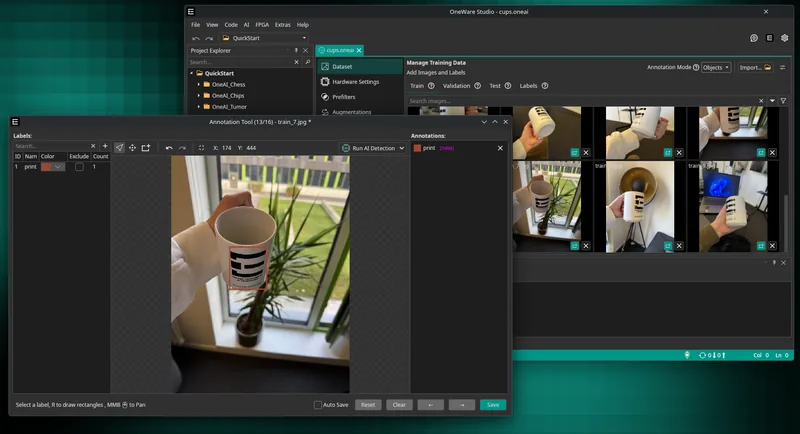
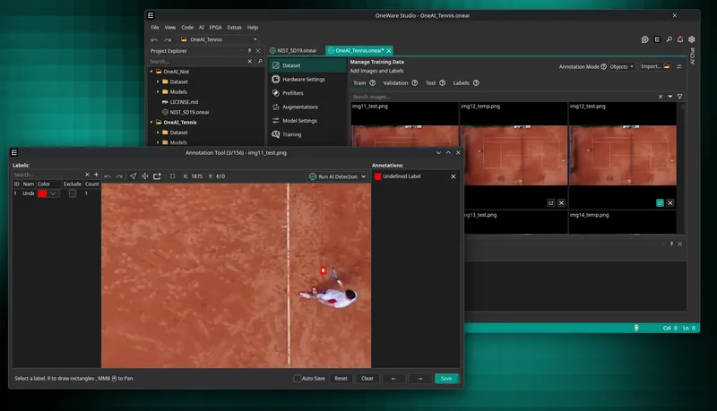
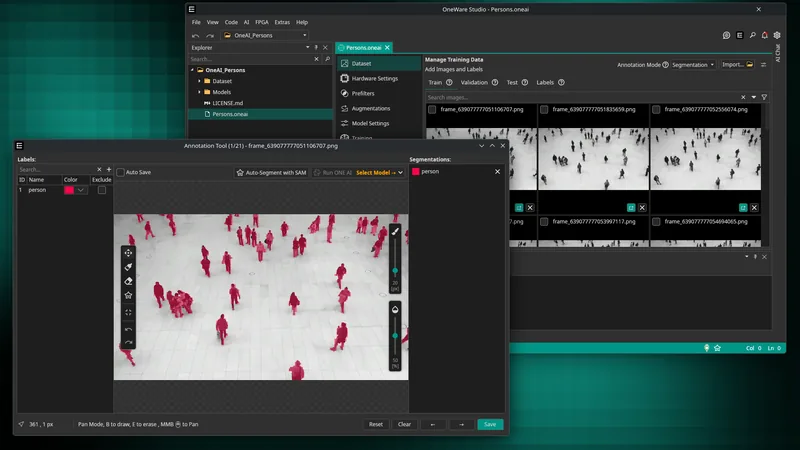

# ONE AI QuickStart Projects

A collection of ready-to-use AI project datasets and models for [ONE AI](https://one-ware.com). Each project can be downloaded and opened directly in ONE AI.

## Projects

| Preview | Project | Description | Tags | Download |
|---------|---------|-------------|------|----------|
|  | **Chess Pieces Detection** | Beginner-friendly object detection demo that detects and localizes chess pieces on a chessboard. | `beginner` `objectDetection` | [Download](https://github.com/one-ware/OneAI.QuickStart/releases/download/1.0/OneAI_Chess.zip) |
|  | **[Potato Chip Classification](https://one-ware.com/projects/chips)** | High-performance image classification demo that distinguishes defective from non-defective potato chips. | `beginner` `classification` | [Download](https://github.com/one-ware/OneAI.QuickStart/releases/download/1.0/OneAI_Chips.zip) |
|  | **[Handwritten Digit Classification](https://one-ware.com/projects/nist)** | Image classification demo using the NIST handwritten digits dataset to recognize numeric characters. | `beginner` `classification` | [Download](https://github.com/one-ware/OneAI.QuickStart/releases/download/1.0/OneAI_NIST.zip) |
|  | **[Wildfire Segmentation](https://one-ware.com/projects/wildfire)** | Segmentation demo for detecting wildfire areas in drone imagery. | `advanced` `segmentation` `FPGA` | [Download](https://github.com/one-ware/OneAI.QuickStart/releases/download/1.0/OneAI_Wildfire.zip) |
|  | **[Scratches Detection Segmentation](https://one-ware.com/projects/scratches)** | Segmentation demo for detecting scratches on a metallic surface. | `advanced` `segmentation` | [Download](https://github.com/one-ware/OneAI.QuickStart/releases/download/1.0/OneAI_Scratches.zip) |
|  | **Tumor Segmentation** | Segmentation demo for detecting and outlining brain tumors in medical imaging data. | `advanced` `segmentation` | [Download](https://github.com/one-ware/OneAI.QuickStart/releases/download/1.0/OneAI_Tumor.zip) |
|  | **[Drones Difference Detection](https://one-ware.com/projects/dronesAndBirds)** | Multi Image Input demo to show ONE AI Difference Detection in action. | `advanced` `objectDetection` `difference` | [Download](https://github.com/one-ware/OneAI.QuickStart/releases/download/1.0/OneAI_DronesAndBirds.zip) |
|  | **[Cups Print Detection](https://one-ware.com/projects/cups)** | Simple demo to detect prints on cups in highly variable background conditions. | `beginner` `objectDetection` | [Download](https://github.com/one-ware/OneAI.QuickStart/releases/download/1.0/OneAI_Cups.zip) |
|  | **[Tennis](https://one-ware.com/projects/tennis)** | Demo to detect small moving objects in a video. | `beginner` `objectDetection` `difference` | [Download](https://github.com/one-ware/OneAI.QuickStart/releases/download/1.0/OneAI_Tennis.zip) |
|  | **[Tracking Persons](https://one-ware.com/projects/persons)** | This demo evaluates person segmentation in a controlled indoor environment. | `beginner` `segmentation` `raspberry pi` | [Download](https://github.com/one-ware/OneAI.QuickStart/releases/download/1.0/OneAI_Persons.zip) |
